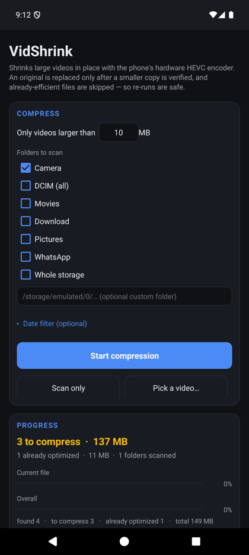
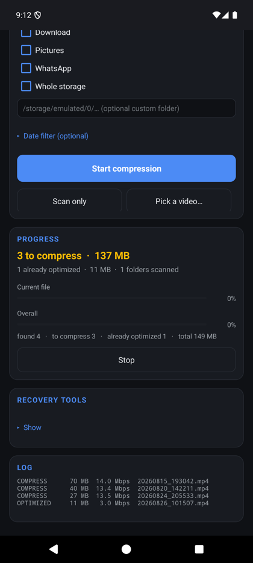
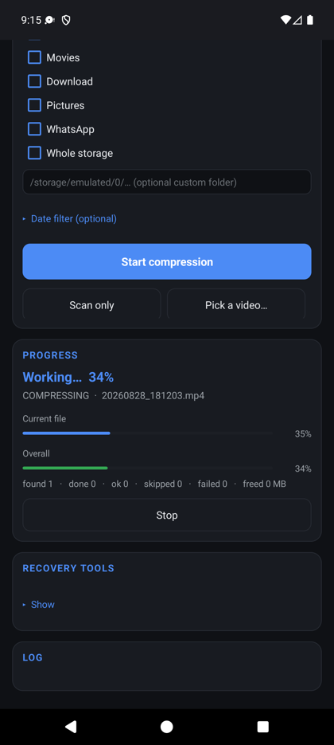

# VidShrink

Shrink large videos **in place** on Android, using the phone's own hardware HEVC
encoder. No cloud, no account, no internet permission — the app cannot phone
home because it never asks for network access.

Built with the Android SDK command-line tools only: no Gradle, no Android
Studio, no third-party libraries. The whole APK is about **66 KB**.

## Screenshots

| Set up | Scan preview | Running |
| :---: | :---: | :---: |
|  |  |  |

- **Set up** — pick folders, a size threshold, and an optional date range.
- **Scan preview** — how much is already optimized versus actually compressible,
  with every file's size and bitrate.
- **Running** — per-file and overall progress, live counters, and a stop button.

## Why

Phone videos are usually stored at a far higher bitrate than they need. VidShrink
re-encodes them to HEVC at a resolution-appropriate bitrate cap, typically
reclaiming 60–70% of the space while keeping the video visually close to the
original.

## Safety model

In-place replacement is only as good as its verification, so each file goes
through this sequence:

1. Transcode to a sibling `*.vidshrink.tmp` — the original is never touched yet.
2. Verify the output: it exists, is non-trivial in size, is genuinely smaller,
   has the same duration (±1.5 s), and can be opened by `MediaMetadataRetriever`.
3. Preserve the capture date (patched into the MP4 header) and the file's
   modification time, then re-apply `DATE_TAKEN` in MediaStore so Gallery keeps
   sorting it correctly.
4. Atomically swap it in, keeping the exact same path and filename.

If any step fails, the temporary file is discarded and the original is left
exactly as it was.

Files that are already efficient (at or below the bitrate cap) are **skipped**,
so running the app twice never double-compresses anything.

## Features

- Scan by folder (presets for Camera, DCIM, Movies, Download, Pictures,
  WhatsApp, or whole storage) plus an optional custom path
- Minimum size threshold, and an optional date range
- **Scan preview** — reports how many videos would actually be compressed
  versus how many are already optimized, with a per-file listing showing each
  file's size and bitrate. The preview asks the encoder's own skip rule, so it
  matches what a real run will do.
- **Pick a single video** to compress instead of a whole folder
- Live progress: current-file percentage, overall percentage (weighted by bytes,
  not file count), and counters for found / done / ok / skipped / failed /
  space freed
- Runs as a foreground service with a wake lock, so it survives screen-off
- Per-file results logged to `Download/vidshrink-log.txt`
- Recovery tools for videos damaged by earlier builds (see below)

## Requirements

- Android 10 (API 29) or newer
- **All files access** — needed to read and replace videos across DCIM, Movies
  and so on. The app prompts for it on first launch; grant it under
  Settings → Special app access → All files access.

## Build

```bash
./build.sh
adb install -r build/vidshrink.apk
```

Needs a JDK plus Android SDK build-tools (`aapt2`, `d8`, `zipalign`,
`apksigner`) and an `android.jar` platform. Override the defaults if your SDK
lives elsewhere:

```bash
SDK=/path/to/sdk BT_VER=36.0.0 PLATFORM=android-34 ./build.sh
```

The script generates a local debug keystore on first run and reuses it, so
`adb install -r` keeps working across rebuilds. That keystore is gitignored —
if you publish releases, sign them with your own key.

## Recovery tools

An earlier build had a bug that squashed portrait videos into landscape frames.
The fix is in, but the tools that repaired the damage are still included, since
they are useful whenever a video's geometry or rotation flag is wrong:

- **Repair rotation flag** — losslessly remuxes to rotation 0 (no re-encode,
  pixels copied verbatim)
- **Un-squash portrait** — re-encodes with the dimensions swapped, inverting a
  squash back to correct proportions

Both read a newline-separated list of absolute file paths from
`Download/vidshrink-repair.txt` or `Download/vidshrink-unsquash.txt`.

### The bug, for reference

Samsung's decoder returns frames already rotated to *display* orientation. The
old code configured the encoder from the *stored* dimensions, so a portrait
video stored as 1920×1080 with a 90° rotation flag got its 1080×1920 frames
squeezed into a 1920×1080 surface. The fix configures the encoder from the
decoder's display dimensions (swapping width and height when the source is
rotated) and writes orientation 0, because the pixels are already upright.

## Project layout

| File | Role |
| --- | --- |
| `MainActivity.java` | Programmatic UI — no layout XML |
| `CompressionService.java` | Foreground service, job orchestration, progress broadcasts |
| `VideoScanner.java` | Folder walk, filters, verified in-place replacement |
| `VideoTranscoder.java` | Decode → GL → HEVC encode, bitrate policy |
| `InputSurface` / `OutputSurface` / `TextureRender` | EGL bridge between decoder and encoder |
| `Mp4DatePatcher.java` | Rewrites creation/modification time in MP4 header boxes |
| `RotationRepair.java` | Lossless rotation-flag remux |
| `UnsquashRepair.java` | Portrait un-squash re-encode |

## Caveats

- Re-encoding is lossy. The defaults are conservative, but this is not a
  reversible operation — the original is gone once replaced. Test on a copy
  first if a video matters to you.
- Speed and codec support depend on the device's hardware encoder.
- HEVC playback is near-universal on modern devices but older software may
  struggle with the output.

## License

MIT — see [LICENSE](LICENSE).
